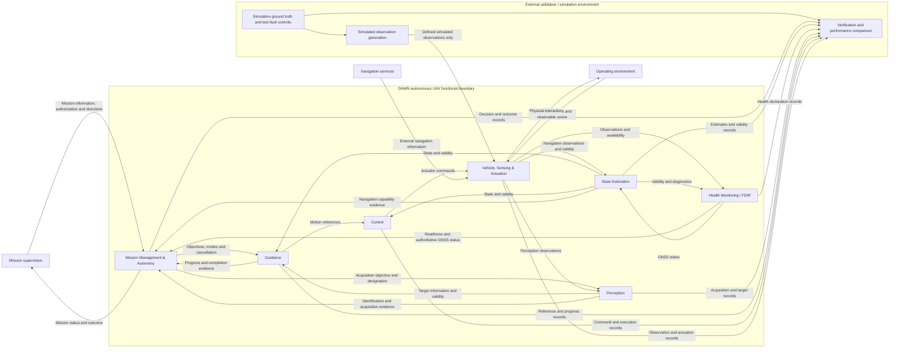
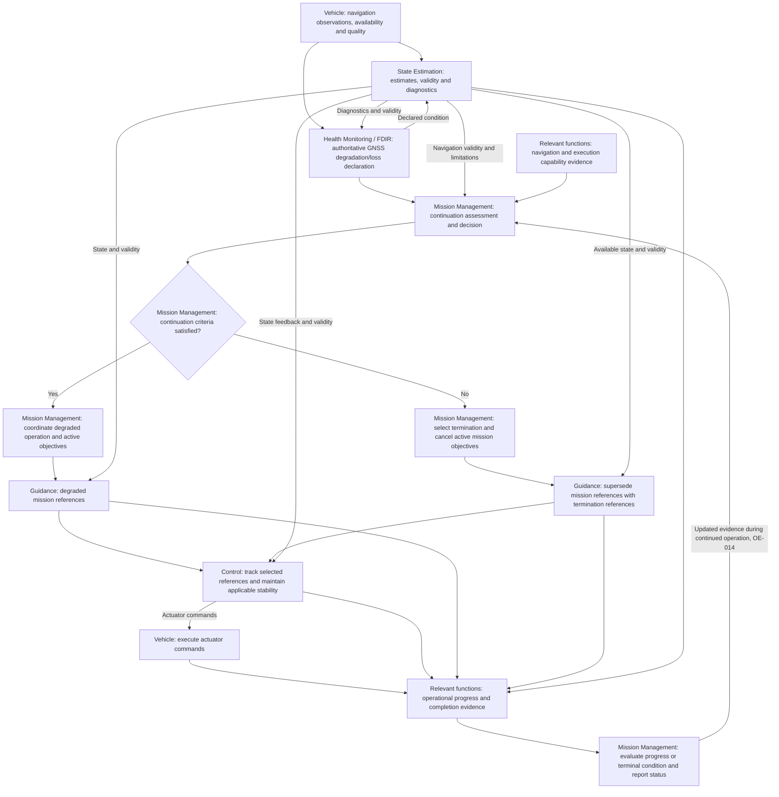

# DAWN Functional Architecture

## 1. Purpose and Source Baseline

This document defines the functional responsibilities, system boundary and
information flows needed to execute the DAWN mission. Its authoritative
sources are the [Mission Concept](01_mission_concept.md) and
[System Requirements](02_system_requirements.md).

**Source version:** this architecture uses those two documents at commit
`988c4254d92378e1118cf0f428e59e6a1faa91c1` on `docs/mission-concept`, the
27-requirement baseline used in the architecture review. The corresponding
[Mission Concept source][mission-baseline] and
[System Requirements source][requirements-baseline] identify the exact text.
At authoring, the checked-out Mission Concept was an earlier version and the
checked-out requirements file was empty; neither source file was changed.
References to Mission Concept sections and requirement IDs below refer to
this identified baseline.

The baseline is simulation-first and covers nominal mission execution and
the defined GNSS degradation/loss scenario. Mission Concept assumptions remain
test preconditions and its exclusions remain outside this architecture.
All 27 requirements remain Draft. Functional allocation establishes
responsibility and traceability; it does not mean verification.

This is a functional architecture, not a software or implementation
architecture. Blocks do not imply separate processes, separate computers,
ROS 2 nodes, PX4 modules, Simulink subsystems, specific algorithms or specific
hardware. No deployment, communication mechanism, numerical method or
perception technology is selected here.

## 2. System Boundary and External Elements

DAWN contains the seven autonomous UAV functional blocks defined in Section 3.
The following elements are external, consistent with Mission Concept §3.

| External element | Relationship to DAWN |
| --- | --- |
| Mission supervision | Supplies mission information, authorizes execution, receives mission status and provides permitted safety or test-termination directions. |
| Navigation services | Supply external navigation information, including GNSS information whose availability and quality may change. |
| Operating environment | Provides the flight area, environmental conditions and designated landing zone with which the vehicle interacts. |
| Validation / simulation environment | Represents vehicle and environment behavior, generates simulated observations, introduces test faults and evaluates recorded evidence against external reference truth. |

Vehicle, Sensing & Actuation denotes the UAV's physical sensing, actuation
and motion functions. Their simulation representation belongs to the external
validation infrastructure. Including those functions inside the DAWN boundary
does not place the simulator, its internal state or its fault controls onboard.
Simulated observations enter through the same defined functional observation
interfaces that stand for onboard information.

Mission supervision and validation may be performed by the same person, but
their functional interfaces remain distinct. A direction to DAWN requires a
DAWN response under SAF-005. Stopping an external test is an infrastructure
action and does not demonstrate autonomous safe termination (OE-016, OE-021).

### 2.1 Overall Functional Architecture

The diagram shows principal flows. Section 4 defines additional coordination,
readiness, capability and evidence flows. Arrows denote functional exchanges,
not selected communication or deployment mechanisms.

Observation generation substitutes for the represented services, sensing and
physical interactions during simulation; the diagram does not require duplicate
live and simulated inputs. The Vehicle observation interface is the functional
entry point, not a mandated hardware arrangement. Verification has no feedback
path carrying truth or verdicts into autonomous operation.

## 3. Functional Blocks and Responsibility Boundaries

### 3.1 Mission Management & Autonomy

Mission Management owns mission progression, operating-mode coordination and
mission-level decisions. It:

- Accepts mission information and distributes the active objectives.
- Enforces authorization from mission supervision; it does not originate that
  authorization. Permitted preparation before authorization remains OE-019.
- Coordinates initialization and pre-flight checks, consumes readiness evidence
  and prevents takeoff when readiness does not permit proceeding.
- Advances mission phases and waypoint objectives using completion evidence.
- Assesses continuation using declared GNSS status, navigation validity and
  relevant system capability; selects continuation or safe termination.
- Coordinates degraded operation and cancellation of planned mission pursuit.
- Orchestrates safe termination and evaluates its completion evidence.
- Makes mission status available and arbitrates supervisory directions under
  the response and precedence rules still to be defined in OE-016.

This allocation supports MIS-001–003, SYS-001–004, AUT-001–006 and SAF-003–005.
Initialization, gates and phase completion remain subject to OE-001–003.

### 3.2 Guidance

Guidance converts the active objective, estimated state, target information
and applicable operating constraints into motion references for Control. This
covers takeoff, waypoint navigation, search motion when needed, approach,
landing and the selected safe-termination behavior.

Guidance evaluates geometric progress and waypoint attainment and reports
completion evidence to Mission Management. Mission Management owns the ordered
objective sequence and phase changes; Guidance does not maintain a competing
mission sequencer. Guidance supersedes obsolete mission references when
termination is selected and reports inability to produce feasible references.

Guidance owns reference generation; Control owns tracking and stabilization.
The reference quantities and admissibility criteria remain interface decisions
(OE-003–005, OE-008, OE-013–015). This block supports GNC-002–005, PER-001 and
SAF-003–004.

### 3.3 Control

Control tracks Guidance references, maintains flight stability using estimated
state feedback and generates actuator commands. It considers applicable
vehicle and actuation limits and reports tracking/execution capability and
limitations. Vehicle functions realize the commands and physical motion.

Control executes the selected nominal, degraded or termination response. It
does not select mission objectives or independently decide continuation.
Control supports GNC-001–005 and SAF-003–004. Stability applicability and
termination feasibility remain OE-004 and OE-015; no control law is selected.

### 3.4 State Estimation

State Estimation produces vehicle position and motion estimates from available
navigation information, including alternative information during GNSS-degraded
and GNSS-unavailable operation. It supplies relevant validity, freshness,
limitations and diagnostic information to its consumers.

It manages information usability within estimation and consumes the declared
GNSS condition from Health Monitoring / FDIR. Its internal diagnostics do not
constitute a competing authoritative GNSS declaration or a mission-continuation
decision. Operational handling of invalid observations must not depend on an
external fault-injection label.

This block owns EST-001–002 and supports stabilization and continuation
assessment. Estimated quantities, performance and alternative-information
availability remain OE-006 and OE-013. The alternative-information source and
its functional path must be specified; landing-zone perception is not assumed
to provide general GNSS-denied navigation.

### 3.5 Perception

Perception searches for and identifies the designated landing zone using its
defined observations and the mission's landing-zone designation. It supplies
target location or relative geometry, identification evidence, acquisition
status and relevant validity to Mission Management and Guidance.

Perception owns perceptual acquisition. Guidance generates any required search
motion and landing references, and Control tracks those references. Mission
Management owns phase progression and prevents approach before the required
identification condition is satisfied.

This block owns PER-001–002 and supports GNC-004–005. It does not imply general
landing-site selection, obstacle avoidance or a navigation capability beyond
its defined outputs. Acquisition, landing evidence and unsuccessful-acquisition
behavior remain OE-007–009; no failure response is selected here.

### 3.6 Health Monitoring / FDIR

Health Monitoring / FDIR evaluates relevant health and capability evidence,
performs the defined pre-flight readiness assessment, and owns the
authoritative declaration of GNSS degradation or loss. It uses available
observations, availability/freshness information and estimation diagnostics,
and reports readiness, GNSS condition and supporting health evidence.

Mission Management owns continuation assessment and response selection.
Neither an individual estimation function nor a health function independently
decides mission continuation. This separates detection and health assessment
from mission-level fault response.

FDIR (Fault Detection, Isolation and Recovery) in this baseline does not imply
comprehensive fault isolation and recovery for all possible UAV failures.
Its fault-response scope is limited to the capabilities required for the
defined GNSS degradation/loss scenario. General fault isolation, recovery to
nominal operation and the future failures excluded by Mission Concept §8 are
not established baseline obligations.

This block owns SYS-003 and SAF-001–002 and supports AUT-004–006 and SAF-003.
Readiness and detection criteria remain OE-002 and OE-010–012.

### 3.7 Vehicle, Sensing & Actuation

This block provides the physical functions needed to sense, actuate and execute
commanded motion. It receives navigation-service information and environmental
stimuli, supplies navigation and perception observations with available
quality/availability information, realizes actuator commands and reports
relevant vehicle/actuation capability and execution evidence.

It supports flight execution under GNC-001–005 and SAF-003, information supply
under EST-001–002, PER-001–002 and SAF-001–002, and initialization/readiness under
SYS-002–003. It does not generate a competing set of control commands or
prescribe hardware, sensor choices or a vehicle simulation model.

## 4. Major Functional Interfaces

Names below abbreviate the blocks: **Mission** = Mission Management & Autonomy;
**Estimation** = State Estimation; **Health** = Health Monitoring / FDIR;
**Vehicle** = Vehicle, Sensing & Actuation. **All blocks** includes Mission's
own local initialization, readiness and capability evidence where applicable.
Interface labels are document references, not new requirement IDs.

| Interface | Producer | Consumer | Information and purpose |
| --- | --- | --- | --- |
| FI-01 | Mission supervision | Mission | Mission definition, route and designated landing objective; authorization; permitted safety/test-termination directions (OE-016–017, OE-019). |
| FI-02 | Mission | Mission supervision | Current mission status, progress, operating condition and outcome; response to supervisory direction (OE-018). |
| FI-03 | Mission | All relevant blocks | Initialization coordination and pre-flight assessment requests (OE-001–003). |
| FI-04 | All blocks | Mission; Health | Local initialization-completion evidence to Mission; readiness and capability evidence to Health (OE-001–002). |
| FI-05 | Health | Mission | Consolidated readiness result; authoritative GNSS declaration and health/capability evidence (OE-002, OE-010–014). |
| FI-06 | Navigation services | Vehicle | External navigation information and available service-quality information, including GNSS availability (OE-010–013). |
| FI-07 | Operating environment | Vehicle | Physical conditions and observable landing-zone scene under the defined test conditions (OE-007, OE-020). |
| FI-08 | Vehicle | Estimation; Health | Navigation observations and their available quality, freshness and availability; relevant sensing status (OE-006, OE-010–013). |
| FI-09 | Vehicle | Perception | Defined observations for designated-zone search and identification (OE-007). |
| FI-10 | Estimation | Guidance; Control; Mission; Health | State estimates and validity to Guidance/Control; navigation-capability evidence to Mission; validity and diagnostics to Health (OE-006, OE-013–014). |
| FI-11 | Health | Estimation | Authoritative GNSS condition and relevant supporting health information for navigation-information handling (OE-010–013). |
| FI-12 | Mission | Guidance; Control; Estimation; Perception; Health; Vehicle, as applicable | Active objectives and operating-mode coordination; applicable constraints and cancellation/termination context. Guidance receives motion objectives; Perception receives designation/acquisition objectives. Other consumers receive the coordination relevant to their function, not a parallel actuator-command stream (OE-003, OE-007, OE-013–017). |
| FI-13 | Perception | Mission; Guidance | Acquisition status and identification evidence to Mission; target geometry and validity to Guidance; acquisition limitations to both (OE-007–009). |
| FI-14 | Guidance | Control | Motion references and applicable execution constraints, including references for the selected termination behavior (OE-003–005, OE-008, OE-015). |
| FI-15 | Control | Vehicle | Actuator commands consistent with the active execution context and applicable limits (OE-004, OE-015). |
| FI-16 | Vehicle | Control; Health; Mission | Vehicle/actuation capability and execution evidence; observable terminal-condition evidence as defined under OE-015. |
| FI-17 | Control | Guidance; Health; Mission | Tracking/execution status and capability limitations to support reference feasibility, health assessment and mission decisions (OE-004, OE-014–015). |
| FI-18 | Guidance | Mission; Health | Objective attainment, phase-completion evidence and reference-generation limitations (OE-003, OE-005, OE-008, OE-014–015). |
| FI-19 | Perception | Health | Acquisition-function readiness and relevant capability/validity limitations for the defined mission, without implying general perception-fault isolation (OE-002, OE-007, OE-014). |
| FI-20 | Vehicle | Operating environment | Physical motion and interaction resulting from actuation; this is a physical exchange, not a data message. |
| FI-21 | Validation / simulation environment: observation generation | Vehicle observation interfaces | Simulated observations representing the defined service/sensing inputs. No direct truth, fault labels, detection verdicts or mission-success flags. |
| FI-22 | All blocks | Validation / simulation environment: evidence evaluation | Observable estimates, health declarations, targets, objectives, decisions, references, commands and execution/outcome evidence for comparison with external truth (OE-020–021). |
| FI-23 | Mission supervision | Validation / simulation environment | External test-termination direction, distinct from direction delivered to DAWN through FI-01 (OE-016). |

For interfaces involving physical quantities, units, coordinate frames, time
references, validity and stale/missing-data behavior must be explicitly defined
when those interfaces are specified. Apply SI units, NED navigation axes
(North, East, Down) and FRD body axes (Forward, Right, Down) unless an interface
explicitly documents otherwise. Any transformation must state source and
destination frames, rotation convention and any quaternion convention used.

Interface specifications must also define information semantics, applicable
limits, timing/freshness expectations, completion evidence and precedence
between active and superseded objectives. No numerical threshold or transport
mechanism is assigned here. OE-013 must establish the alternative-navigation
information source and its path to Estimation; FI-06/FI-08 describe entry for
service/sensed observations without selecting that source.

## 5. Functional Mission and Response Chains

### 5.1 Initialization, Nominal Execution and Landing

Mission coordinates initialization and waits for the defined completion
condition before pre-flight checks. Health evaluates readiness from functional
evidence; Mission applies the readiness gate and the separate authorization
gate. OE-019 defines which preparations may precede authorization.

Mission then progresses through takeoff, ordered waypoint navigation,
designated-zone acquisition, approach, precision landing and mission completion
as defined by Mission Concept §4. Guidance reports motion-objective attainment;
Mission decides phase progression using the applicable criteria (OE-003,
OE-005, OE-008).

During acquisition, Perception reports search status and identification evidence.
Mission prevents approach until the required identification condition holds.
Guidance uses the active landing objective, valid target information and
estimated vehicle state to generate approach/landing references. Control tracks
them and Vehicle executes motion. Successful acquisition is not assumed to
supply general navigation estimates. Acquisition failure remains OE-009.

### 5.2 GNSS Degraded-Response Chain

The diagram expresses functional dependencies, not a timing schedule or a
selected safe maneuver. Health owns detection; Estimation owns estimates and
their validity; Mission owns continuation assessment, decision and transition.
Guidance, Control and Vehicle execute the selected response. Neither Estimation
nor Health independently authorizes continuation.

OE-010–012 define degradation/loss and detection performance. OE-013 defines
available alternative information and degraded-estimation performance. OE-014
defines continuation criteria and reassessment as conditions change. Continued
operation is conditional; a degraded transition alone does not establish
successful degraded mission completion.

### 5.3 Safe-Termination Execution and Evidence

The complete functional chain is:

1. Health, Estimation and relevant execution functions supply health and
   capability evidence to Mission.
2. Mission assesses continuation and selects safe termination when continuation
   is not permitted by the defined criteria.
3. Mission ceases planned mission pursuit and cancels active objectives,
   including route and acquisition objectives as applicable (SAF-004).
4. Guidance supersedes active mission references with references for the
   selected predefined termination behavior. Control and Vehicle execute them
   using the available navigation information and applicable constraints.
5. Relevant functions report execution and operational completion evidence;
   Mission determines whether the defined terminal condition has been reached
   and reports the outcome. External validation evaluates the recorded outcome
   against independent reference evidence.

OE-015 must define the safe-termination behavior, terminal state, feasibility
under remaining navigation capability and completion evidence. This architecture
does not select a specific maneuver or terminal state, assume designated-zone
acquisition is required for termination, or assume adequate state information
always survives the fault. Transition timing and handling of superseded
references must be specified with OE-003, OE-014 and OE-015.

Selecting termination, issuing commands or reporting an internal completion
flag alone is insufficient evidence of MIS-003. Reaching the defined terminal
state must be demonstrated. Safe termination demonstrates resilience without
constituting planned mission completion. External simulation termination or
supervisor intervention alone is not evidence of successful autonomous DAWN
safe termination (Mission Concept §6; OE-016, OE-021).

## 6. Simulation Ground-Truth Separation

Simulation ground truth is external validation information. It may generate
simulated observations and support verification and performance comparison.
The simulated observations must obey their defined information interfaces and
applicable observation/error/availability assumptions; they are not a channel
for forwarding privileged reference state.

Ground truth shall not be used directly by:

- **State Estimation** as onboard navigation information or an alternative
  navigation source during GNSS loss.
- **Health Monitoring / FDIR** as fault truth, injection notifications or an
  externally supplied correct degradation/loss declaration.
- **Perception** as externally supplied detection truth, correct identification
  or privileged target geometry outside its defined observation/mission inputs.
- **Mission Management** for autonomous decisions, phase-completion gates or
  terminal-state determination.

The same information boundary applies to Guidance and Control: they consume
operational estimates, objectives and target/reference information, not
privileged simulation state. A truth-derived navigation estimate, fault flag,
detection result or success verdict must not be routed indirectly through
another block into an autonomous decision path.

Defined mission information, including route and landing-zone designation,
remains legitimate input (SYS-001, OE-017). Its permitted content must be
specified so that designation is not confused with an externally supplied
identification result. Fault injection changes the represented observations,
quality or availability; detection must arise from the information available
to DAWN. External truth may evaluate estimation error, detection performance,
landing precision and terminal-state achievement without feeding those
verification results back into autonomous execution.

## 7. Requirements Allocation

The primary owner is accountable for the functional outcome and its coordination;
it need not perform every contributing action. Significant contributors are
listed explicitly. Routine feedback dependencies are not repeated in every
row. All blocks participate in their applicable initialization and readiness.
Allocation is not verification, and no requirement status is changed.

| Requirement | Primary functional owner | Significant contributors and responsibility |
| --- | --- | --- |
| MIS-001 — Nominal mission completion | Mission | All other blocks provide readiness, navigation, acquisition and flight execution for the end-to-end outcome. |
| MIS-002 — Degraded mission continuation | Mission | Health declares GNSS condition; Estimation supplies degraded navigation; Guidance, Control, Perception and Vehicle execute the remaining mission as applicable. |
| MIS-003 — Resilient termination outcome | Mission | Health and Estimation supply capability evidence; Guidance, Control and Vehicle execute termination and provide outcome evidence under OE-015. |
| SYS-001 — Mission information input | Mission | Guidance consumes route/objectives; Perception consumes landing designation. Mission supervision supplies the external information. |
| SYS-002 — System initialization | Mission | All blocks establish and report their initialized state; Mission coordinates completion before pre-flight checks. |
| SYS-003 — Pre-flight readiness assessment | Health | All blocks supply relevant readiness evidence; Mission coordinates checks and consumes the result. |
| SYS-004 — Mission status availability | Mission | Relevant blocks supply status; external mission supervision receives the consolidated mission status. |
| GNC-001 — Flight stability | Control | Estimation supplies feedback; Vehicle realizes actuation and motion. |
| GNC-002 — Autonomous takeoff | Guidance | Mission gates entry and completion; Control tracks takeoff references; Estimation and Vehicle support execution. |
| GNC-003 — Waypoint navigation | Guidance | Mission owns objective order and progression; Control, Estimation and Vehicle support tracking and attainment. |
| GNC-004 — Autonomous approach | Guidance | Mission enforces the identification gate; Perception supplies valid target information; Control, Estimation and Vehicle support approach execution. |
| GNC-005 — Precision landing | Guidance | Perception and Estimation supply target/state information; Control and Vehicle execute landing; Mission manages completion. |
| EST-001 — Vehicle state estimation | Estimation | Vehicle supplies sensed/service observations through defined interfaces. |
| EST-002 — Degraded navigation | Estimation | Vehicle supplies applicable alternative observations; Health supplies GNSS status. Alternative-information source/availability remain OE-013. |
| AUT-001 — Mission authorization | Mission | External mission supervision supplies authorization; Mission enforces the execution boundary. |
| AUT-002 — Takeoff readiness gate | Mission | Health supplies readiness assessment; Guidance, Control and Vehicle execute only the permitted takeoff objective. |
| AUT-003 — Nominal phase progression | Mission | Guidance, Perception, Health and other relevant functions supply phase-completion evidence. |
| AUT-004 — Continuation assessment | Mission | Health supplies declared condition and capability evidence; Estimation supplies navigation validity; relevant execution functions report limitations. |
| AUT-005 — Continuation or termination selection | Mission | Health, Estimation and execution functions support the assessment; decision authority remains with Mission. |
| AUT-006 — Transition to degraded operation | Mission | Estimation, Guidance, Control and other affected functions apply the coordinated execution context; Health reports navigation status. |
| PER-001 — Landing-zone search | Perception | Mission manages acquisition; Guidance, Control, Estimation and Vehicle support any required search motion and observations. |
| PER-002 — Landing-zone identification | Perception | Vehicle supplies observations; Mission gates approach; Guidance consumes identified-target information. |
| SAF-001 — GNSS degradation detection | Health | Vehicle supplies observations/quality; Estimation supplies relevant validity and diagnostics. |
| SAF-002 — GNSS loss detection | Health | Vehicle supplies availability/freshness information; Estimation supplies relevant diagnostics. |
| SAF-003 — Safe termination execution | Mission | Guidance generates termination references; Control and Vehicle execute; Estimation and Health support capability assessment and operational completion evidence. |
| SAF-004 — End mission pursuit | Mission | Guidance supersedes active mission references; Perception ceases canceled acquisition objectives; Control follows the selected termination context. |
| SAF-005 — Supervisor safety intervention | Mission | External supervision supplies direction; affected functions execute the response under OE-016. External test termination remains distinct. |

## 8. Open Decisions and Derived-Requirement Candidates

The existing [Open Engineering Decisions][open-decisions] remain unresolved.
The following items identify architecture/interface work, not additional
requirements, selected designs or revised acceptance criteria.

| Existing decisions | Architectural resolution needed |
| --- | --- |
| OE-001–003 | Local initialization evidence, readiness aggregation, authorization/readiness gating and phase/mode transition completion semantics. |
| OE-004–006 | Required state and reference quantities, stability applicability, tracking/attainment evidence and physical information conventions. |
| OE-007–009 | Landing designation, identification/target validity, search-motion coordination, landing completion evidence and acquisition-failure scope/response. |
| OE-010–012 | Authoritative GNSS declarations, input availability semantics and detection timeliness/accuracy criteria. |
| OE-013–014 | Alternative-information source and path, estimate validity, remaining capability, continuation assessment and reassessment. |
| OE-015 | Feasible termination behavior and terminal state, supersession of mission references and operational completion evidence. |
| OE-016–019 | Supervisory direction precedence, mission-input contents, status availability and preparation/authorization boundary. |
| OE-020–021 | Test conditions, validation observability and independent evidence distinguishing continuation, completion and safe termination. |

Potential derived obligations include initialization/readiness reporting;
state/target validity and stale-data handling; declaration-to-response timing;
coordinated mode changes and obsolete-objective cancellation; feasible guidance
references; terminal-state evidence; supervisory response precedence; and
exclusion of privileged truth from operational information paths. These must be
resolved against the existing requirements and decisions before any new
requirement is proposed for the baseline. No new requirement IDs are assigned.

[mission-baseline]: https://github.com/iggybago/dawn-autonomous-uav/blob/988c4254d92378e1118cf0f428e59e6a1faa91c1/docs/01_mission_concept.md
[requirements-baseline]: https://github.com/iggybago/dawn-autonomous-uav/blob/988c4254d92378e1118cf0f428e59e6a1faa91c1/docs/02_system_requirements.md
[open-decisions]: https://github.com/iggybago/dawn-autonomous-uav/blob/988c4254d92378e1118cf0f428e59e6a1faa91c1/docs/02_system_requirements.md#open-engineering-decisions
